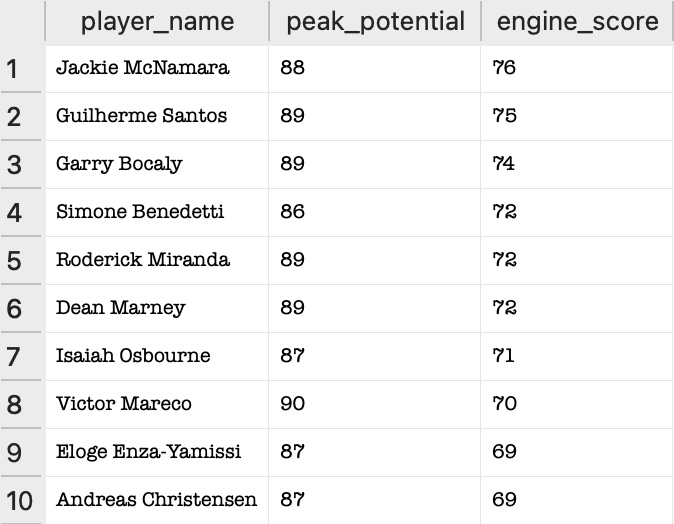
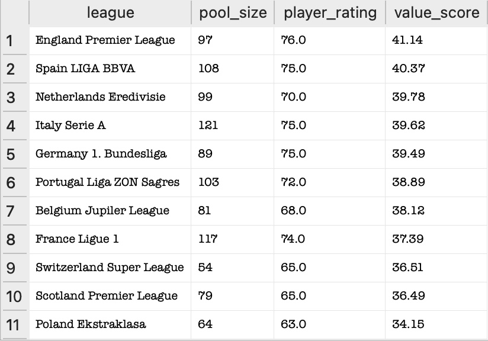

# Football Data Analysis Project: A Data-Driven Scouting Model
- **Author:** Anton Tarusau
- **Project Goal:** Finding Undervalued Talented Players With Elite Work Rate And Identifying The Leagues They Play In Using SQL.
- **Problem Statement:** Organisations operating with limited capital must find ways to compete with high-budget incumbents. In the professional sports industry, this manifests as "Market Inefficiency." This project develops a quantitative model to identify high-value assets (players) in undervalued secondary markets (leagues) to maximise ROI.
- **The Methodology:** This analysis was conducted in three distinct phases, moving from broad talent discovery to specific market procurement.


## Phase 1: Environment & Setup
- **Tool:** DB Browser for SQLite on macOS.
- **Database:** European Soccer Database (SQLite).
- **Status:** Data successfully connected and verified.


## Phase 2: Growth Potential Mining (Predictive Growth Modeling)
- **Goal:** Identify young, high-ceiling talent currently operating under the radar.
- **Criteria:** Potential > 85, Overall Rating < 75.
- **Outcome:** A table of the most talented players with the highest theoretical growth gap.

### Query: Best High-Potential Players
```sql
SELECT
  p.player_name,
  MAX(pa.potential) AS peak_potential,
  MAX(pa.overall_rating) AS peak_rating,
  (MAX(pa.potential) - MAX(pa.overall_rating)) AS growth_potential
FROM Player p
JOIN Player_Attributes pa ON p.player_api_id = pa.player_api_id
GROUP BY p.player_name
HAVING peak_rating < 75
AND peak_potential > 85
ORDER BY growth_potential DESC;
```

## Phase 3: Attribute Specialisation: The "Engine" Score (Multivariate Feature Engineering)
- **Goal:** Isolate the players with high work rate from the general high-potential list.
- **Criteria:** Using a **Common Table Expression (CTE)**, I calculated a custom `Engine_Score` by averaging Stamina, Interceptions, Marking, and Reactions.
- **Outcome:** Identification of the top 10 physical specialists ready for high-intensity systems.

### Query: Top 10 Talented Players With High Work rate
```sql
WITH High_Potential_Players AS (
  SELECT 
     p.player_name, 
     p.player_api_id,
     MAX(pa.potential) AS peak_potential, 
     MAX(pa.overall_rating) AS peak_rating,
	 (MAX(pa.potential) - MAX(pa.overall_rating)) AS growth_potential
  FROM Player p
  JOIN Player_Attributes pa ON p.player_api_id = pa.player_api_id
  GROUP BY p.player_name
  HAVING peak_potential > 85 AND peak_rating < 75 AND growth_potential >= 15
)
SELECT 
  hp.player_name,
  hp.peak_potential,
  (MAX(pa.stamina) + MAX(pa.interceptions) + MAX(pa.marking) + MAX(pa.reactions)) / 4 AS engine_score
FROM High_Potential_Players hp
JOIN Player_Attributes pa ON hp.player_api_id = pa.player_api_id
GROUP BY hp.player_name
ORDER BY engine_score DESC
LIMIT 10;
```
### Top 10 Valuable Players

*Figure 1: High-Potential Asset Identification – Top 10 Specialists by Engine Score.*


## Phase 4: Market Value Analysis (Geographic Arbitrage Analysis)
- **Goal:** Pinpoint which leagues offer the best players for cheaper prices.
- **Criteria:** Analysed league-wide averages to find where the value_score is relatively high comparing to player_rating.
- **Outcome:** Identification of Market Arbitrage opportunities in secondary European leagues.

### Query: Best Leagues With Undervalued High Work-rate Players 
```sql
SELECT
  l.name AS league,
  COUNT(DISTINCT p.player_api_id) AS pool_size,
  ROUND(AVG(pa.overall_rating)) AS player_rating,
  ROUND((AVG(pa.stamina) + AVG(pa.interceptions) + AVG(pa.marking) + AVG(pa.reactions)) / 4, 2) AS value_score
FROM League l
JOIN Match m ON l.id = m.league_id
JOIN Player_Attributes pa ON m.home_player_1 = pa.player_api_id
JOIN Player p ON pa.player_api_id = p.player_api_id
GROUP BY l.name
ORDER BY value_score DESC
```
### Market Audit Results:

*Figure 2: Geographic Market Arbitrage – Comparison of Physical Output Efficiency across European Leagues.*


## Key Findings: Top 10 Recommended Targets
Based on the final analysis, these ten players represent the best combination of high growth potential and elite work rate.

- | Player Name | Potential | Engine Score |

- | **Jackie McNamara**     | 88 | 76 | 
- | **Guilherme Santos**    | 89 | 75 | 
- | **Garry Bocaly**        | 89 | 74 |  
- | **Simone Benedetti**    | 86 | 72 | 
- | **Roderick Miranda**    | 89 | 72 | 
- | **Dean Marney**         | 89 | 72 |  
- | **Isaiah Osbourne**     | 87 | 71 | 
- | **Victor Mareco**       | 90 | 70 | 
- | **Eloge Enza-Yamissi**  | 87 | 69 |  
- | **Andreas Christensen** | 87 | 69 | 

**Final Recommendation:** To maximise ROI, scouting efforts should be shifted away from high-premium leagues (e.g., Premier League) toward the **Netherlands Eredivisie and Belgium Jupiler League**, which show the highest density of work rate specialists relative to market price.

## Challenges And Constraints:
- **Data Normalisation:** The dataset contained players with varying game counts. I implemented MAX() and GROUP BY logic to ensure that a single bad performance didn't skew the 'Peak Potential' of a high-value asset.
- **Sample Representation:** To ensure market analysis was statistically significant, I utilised COUNT(DISTINCT) to verify a sufficient pool size before drawing conclusions about league-wide value.

## Technical Stack
- **Language:** SQL (SQLite)
- **Advanced Concepts:** Common Table Expressions (CTEs), Multi-table Joins, Data Aggregations (`MAX`, `AVG`), Data Cleaning (`ROUND`, `DISTINCT`).
- **Logic:** Strategic Data Funnelling and Custom Metric Creation.
